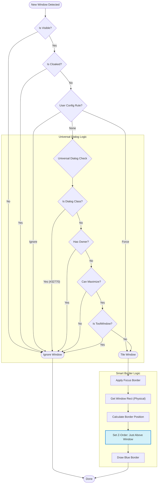

# Start
# SeelenWM Logic Flowchart

Here is the visual breakdown of the "Universal Logic" we built.

> [!NOTE]
> This flowchart uses quotes around labels to prevent parsing errors.

## Key Decisions

1.  **Can Maximize?**
    -   This is the "Golden Rule".
    -   **Apps** (Chrome, VS Code, Notepad) let you maximize them to fill the screen.
    -   **Dialogs** (Folder In Use, Settings, Popups) usually have a fixed size and *cannot* be maximized.
    -   By checking this, we filter out 99% of annoyance windows without knowing their names!

2.  **Smart Z-Order**
    -   Instead of forcing the Blue Border to be "Always On Top" (which covers everything), we tell Windows: *"Put this border right on top of the target window, but let other topmost windows (like QuickLook) sit above it."*
